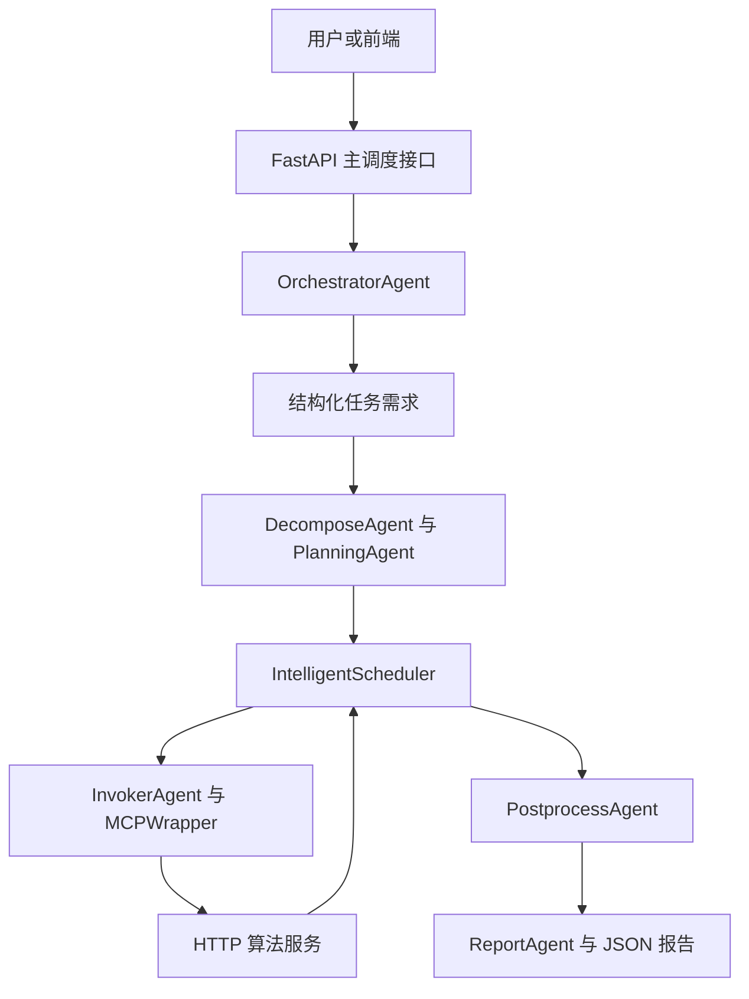
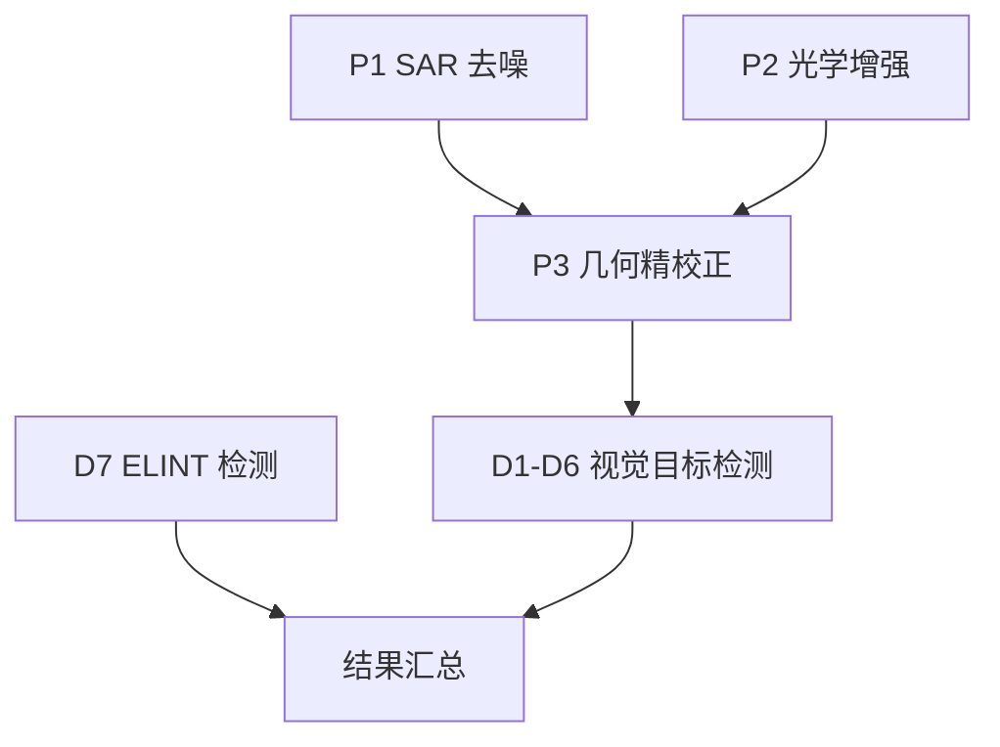
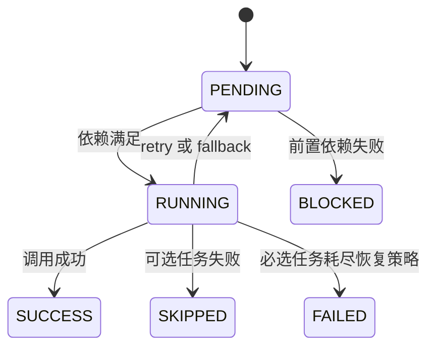

# agent_LLM：大模型增强的多载荷智能任务调度系统

`agent_LLM` 面向 SAR、光学（OPTICAL）与电子侦察（ELINT）等多载荷遥感目标识别任务，构建了一套“自然语言/任务 XML 理解—能力匹配—DAG 规划—依赖调度—算法调用—结果融合—质量报告”的智能体调度框架。

系统当前采用 **FastAPI + Ollama + 能力注册表 + MCP 风格 JSON 协议 + HTTP 算法服务** 的实现方式：大模型负责将用户自然语言约束为结构化需求，确定性程序负责 XML 解析、冲突检查、任务拆解、依赖调度和失败处置，具体算法服务负责 SAR/光学预处理、几何精校正、YOLO 目标检测、ResNet50 切片识别及 ELINT 模拟检测。

> 说明：本项目中的 “MCP” 指项目内部定义的工具请求/响应数据协议，当前传输层为 HTTP，并非 stdio/Popen 形式的标准 MCP Server。几何精校正模块会在算法服务内部通过 `subprocess.run()` 调用 C++ 可执行程序 `services/algorithm_service/myprogram`。

## 目录

- [1. 总体概述](#1-总体概述)
- [2. 系统模型](#2-系统模型)
- [3. 原理介绍](#3-原理介绍)
- [4. 实现方法](#4-实现方法)
- [5. 仿真结果](#5-仿真结果)
- [6. 当前进展](#6-当前进展)
- [7. 下一步计划](#7-下一步计划)
- [8. 总结](#8-总结)
- [附录 A：接口说明](#附录-a接口说明)
- [附录 B：部署与运行](#附录-b部署与运行)
- [附录 C：项目结构](#附录-c项目结构)
- [附录 D：当前实现边界](#附录-d当前实现边界)

---

## 1. 总体概述

### 1.1 建设目标

传统多算法识别系统通常把“预处理—校正—检测—融合—报告”固化为单一流水线。当载荷类型、目标类别、输入数据、算法服务状态或任务约束发生变化时，固定流程难以自动裁剪任务，也难以在局部失败后给出可解释的恢复策略。

本项目将一次业务请求抽象为共享执行上下文 `ExecutionContext`，由多个职责清晰的 Agent 协同处理：

1. 解析用户自然语言和 XML 任务配置，得到结构化需求；
2. 根据已注册工具的能力描述动态选择算法，而不是直接写死完整调用链；
3. 将总任务拆解为具有依赖关系的子任务 DAG；
4. 按拓扑依赖形成并行批次，异步调用可执行工具；
5. 对失败任务执行重试、备用工具切换、可选任务跳过或依赖阻塞；
6. 汇总多源检测结果，输出质量状态、执行轨迹与最终报告。

### 1.2 适用任务

| 任务模式 | 输入 | 当前能力 | 主要输出 |
| --- | --- | --- | --- |
| 全域底图识别 `base_map` | 用户指令、XML、GeoTIFF | SAR 去噪、光学增强、几何精校正、SAR/光学目标检测、ELINT 检测 | 目标列表、任务状态、调度轨迹、JSON 报告 |
| 切片识别 `slice` | 载荷类型、目标大类、切片路径列表 | 按载荷和目标大类选择 ResNet50 模型，输出细分类别 | 切片类别、置信度、来源信息 |
| 底图与切片联合识别 | 可选底图 + 多张切片 | 分别执行底图检测与切片分类，再汇总结果 | 当前为结果拼接，真正跨尺度融合待实现 |
| 自然语言需求理解 | 用户任务描述、XML 上下文 | Ollama 结构化输出、XML/指令一致性检查、歧义澄清 | `RequirementSpec` 或澄清问题 |

### 1.3 当前技术栈

| 层级 | 主要技术 | 作用 |
| --- | --- | --- |
| API 层 | FastAPI、Pydantic | 请求校验、任务提交、健康检查和结果返回 |
| LLM 层 | Ollama、`qwen3:14b`、JSON Schema | 自然语言需求提取与结构化约束 |
| 智能体层 | Python Agent 类、共享上下文 | 理解、拆解、规划、调用、重规划、后处理和报告 |
| 调度层 | DAG、`asyncio`、确定性状态机 | 依赖检查、并行执行、重试与失败传播 |
| 协议层 | MCP 风格 `MCPRequest/MCPResponse`、HTTP JSON | 调度器与算法服务解耦 |
| 算法层 | OpenCV、Rasterio、YOLO、PyTorch/ResNet50、C++ 程序 | 影像处理、几何校正、检测和分类 |
| 部署层 | Docker Compose、NVIDIA Runtime | GPU 算法环境与服务编排 |

### 1.4 总体架构



系统并非由大模型直接控制所有执行细节。当前设计采用“**LLM 负责语义理解，规则和数据结构负责可靠执行**”的混合架构，以降低自然语言歧义对算法调用链的直接影响。

---

## 2. 系统模型

### 2.1 总任务模型

一次总任务可表示为：

$$
R = \langle id, I, X, P, C, O \rangle
$$

其中：

- \(id\)：任务编号 `task_id`；
- \(I\)：自然语言指令 `instruction`；
- \(X\)：XML 需求文件和影像数据路径；
- \(P\)：载荷类型集合，如 `SAR`、`OPTICAL`、`ELINT`；
- \(C\)：目标类别集合，如 `plane`、`ship`、`vehicle`；
- \(O\)：输出格式、置信度和建议等输出要求。

代码中的 `TaskRequest` 保存原始请求，`ExecutionContext` 保存从理解到报告的完整执行状态。所有 Agent 对同一上下文进行增量读写，从而避免模块之间传递大量松散参数。

### 2.2 结构化需求模型

`core/llm_schema.py` 使用 Pydantic 定义 `RequirementSpec`，主要字段如下：

| 字段 | 类型或取值 | 含义 |
| --- | --- | --- |
| `task_type` | `str` | 任务类型，默认 `multi_payload_detection` |
| `objective` | `str` | 用户任务目标的简洁描述 |
| `detection_mode` | `base_map` / `slice` | 底图检测或切片识别 |
| `payload_types` | `SAR` / `OPTICAL` / `ELINT` 列表 | 用户明确提出的载荷类型 |
| `target_classes` | `plane` / `ship` / `vehicle` 列表 | 用户明确提出的目标大类 |
| `required_capabilities` | 能力名称列表 | 如 `preprocess`、`geometry`、`detect` |
| `constraints` | 约束对象 | 当前包括是否需要几何校正 |
| `resources` | 资源对象 | GPU/CPU 偏好及最大并行数 |
| `deadline_seconds` | 可选正整数 | 用户明确提出的截止时间 |
| `priority` | `low` / `normal` / `high` / `urgent` | 任务优先级 |
| `output_requirements` | 输出对象 | JSON、置信度和建议要求 |

LLM 输出必须通过 JSON Schema 和 Pydantic 校验。模型不得根据 XML 擅自复制用户没有明确表达的载荷或目标，也不得根据目标类别反推载荷类型。

### 2.3 工具能力模型

每个可调用工具由 `ToolCapability` 描述：

$$
C_i = \langle name, stage, modes, payloads, targets, geo, optional, fallback, output \rangle
$$

| 属性 | 说明 |
| --- | --- |
| `tool_name` | 工具在注册表中的唯一名称 |
| `stage` | `preprocess`、`geometry` 或 `detect` |
| `modes` | 支持的 `base_map`/`slice` 模式 |
| `payload_types` | 支持的载荷类型 |
| `target_classes` | 支持的目标类别 |
| `requires_geo` | 是否依赖几何精校正 |
| `optional` | 失败后能否跳过而不阻塞主流程 |
| `fallback_tools` | 失败后的备用工具列表 |
| `output_schema` | 期望的输出字段 |

当前能力表包含 11 个工具：3 个预处理/校正工具、6 个 SAR/光学目标检测工具、1 个 ELINT 检测工具和 1 个切片识别工具。

### 2.4 子任务与 DAG 模型

任务拆解结果表示为有向无环图：

$$
G=(V,E)
$$

- \(V\)：`SubTask` 节点集合；
- \(E\)：由 `dependencies` 定义的依赖边；
- 若 \((v_i,v_j)\in E\)，则 \(v_j\) 只有在 \(v_i\) 成功或可接受地跳过后才能进入就绪状态。

典型的 SAR + 光学 + ELINT、多目标底图识别 DAG 如下：



在当前能力模型中，`P1`、`P2` 和 `D7` 无前置依赖，可以进入同一并行批次；`P3` 等待视觉预处理完成；视觉检测任务等待 `P3` 完成。

### 2.5 状态与失败模型

子任务状态定义在 `core/enums.py`：



调度器对任务 \(v_i\) 的就绪判定为：

$$
ready(v_i)=\bigwedge_{d\in dep(v_i)}\left(success(d)\lor skipped\_optional(d)\right)
$$

失败决策顺序为：

1. 若仍有重试预算，则 `retry`；
2. 若存在已注册备用工具，则 `fallback`；
3. 若当前任务为可选任务，则 `skip`；
4. 否则标记为 `FAILED`；
5. 依赖该失败任务的下游节点标记为 `BLOCKED`。

---

## 3. 原理介绍

### 3.1 自然语言与 XML 的混合需求理解

`/api/v1/task/submit` 调用 `OrchestratorAgent.prepare_with_llm()`。其核心逻辑不是让 LLM 覆盖 XML，而是执行分层融合：

- XML 提供确定性的基础配置；
- LLM 只提取用户自然语言中明确表达的载荷、目标、资源、优先级等信息；
- 程序比较 LLM 结果与 XML 结果；
- 兼容时采用用户指令中的更窄目标集合；
- 冲突或关键字段缺失时返回澄清问题，不执行后续算法；
- 未提供 `instruction` 时直接采用 XML-only 模式，不调用大模型。

当前冲突处理规则如下：

| 条件 | 系统行为 |
| --- | --- |
| 指令与 XML 的目标/载荷兼容 | 合并后继续拆解和规划 |
| 指令目标超出 XML 目标范围 | 返回 `target_classes` 冲突问题 |
| 指令未说明目标，但 XML 有目标 | 要求用户确认是否使用 XML 目标 |
| 指令和 XML 都未说明目标 | 要求用户明确飞机、舰船或车辆 |
| 指令未说明载荷，但 XML 有载荷 | 自动继承 XML 载荷 |
| 指令和 XML 都未说明载荷 | 要求用户明确 SAR、OPTICAL 或 ELINT |

该机制把 LLM 的开放语义能力限制在结构化边界内，将是否执行、执行哪些算法的最终判断交给可审计程序。

### 3.2 基于能力匹配的动态任务拆解

`DecomposeAgent` 不读取一个固定的完整流水线，而是遍历 `ToolRegistry` 中的能力表，根据以下条件筛选工具：

- 当前任务模式是否被工具支持；
- 请求的载荷是否与工具能力匹配；
- 请求的目标类别是否与工具能力匹配；
- 工具是否已注册可调用 URL；
- 视觉检测是否具备所需的预处理和几何校正依赖；
- 任务是必选还是可选。

因此，当请求由 `OPTICAL + ship` 改为 `SAR + plane` 时，系统会生成不同的工具组合，而不是执行所有已知算法。

### 3.3 可解释规划与并行批次

`PlanningAgent` 对子任务依赖图执行轻量拓扑分层：

1. 找出依赖均已进入已完成集合的任务；
2. 将这些任务组成同一批次；
3. 记录批次、阶段、任务选择原因和并行理由；
4. 更新已完成集合，继续生成下一批次。

结果分别写入：

- `execution_plan`：任务 ID 的有序列表；
- `plan_rationale`：按批次组织的解释信息。

当前规划器不进行耗时、显存、准确率或成本优化；这些属于下一阶段的资源感知规划能力。

### 3.4 依赖驱动的异步调度

`IntelligentScheduler` 不是按列表串行执行任务，而是在每轮调度中：

1. 从 `PENDING` 任务中计算所有 ready 节点；
2. 将同一轮 ready 节点统一标记为 `RUNNING`；
3. 通过 `InvokerAgent.invoke_many()` 并发调用；
4. 保存 `ToolResult` 并更新任务状态；
5. 对失败结果调用 `ReplanDecisionAgent`；
6. 将就绪、开始、成功、重试、跳过、失败和阻塞事件写入结构化轨迹。

这使并行性来源于 DAG 的依赖关系，而不是人工维护并行任务列表。

### 3.5 MCP 风格工具调用协议

`MCPWrapper` 将 `ExecutionContext + SubTask` 转换为统一 `MCPRequest`，`AsyncHTTPClient` 再将其发送到注册表给出的 HTTP URL。请求中不仅包含当前任务参数，还包含已经完成的上游结果，供下游算法查找预处理或校正产物。

```json
{
  "task_id": "TASK_001",
  "subtask_id": "D5",
  "tool_name": "optical_ship_service",
  "input_data": {
    "tiff_path": "/app/data/sample_packet/source.tif",
    "xml_config": {},
    "previous_results": {
      "P3": {
        "geo_corrected_path": "/app/data/sample_packet/geo_source.tif"
      }
    },
    "metadata": {},
    "orchestration": {
      "stage": "detect",
      "capability_id": "optical_ship_service",
      "reason": "OPTICAL ship detection requested",
      "optional": false
    }
  },
  "parameters": {
    "mode": "base_map"
  },
  "output_schema": ["detections"]
}
```

统一协议使调度层不必了解每个算法函数的内部实现，只需依赖工具名称、能力描述、输入输出契约和服务地址。

### 3.6 算法执行与结果闭环

算法服务 `services/algorithm_service/app.py` 根据 `tool_name` 分发请求：

| 阶段 | 工具 | 当前实现 |
| --- | --- | --- |
| SAR 预处理 | `sar_denoise_service` | 调用 `SAR_pro.py` 完成 SAR 影像处理 |
| 光学预处理 | `optical_enhance_service` | 调用 `opt_pro.py` 完成光学增强 |
| 几何处理 | `geo_correction_service` | 通过 C++ 程序进行几何精校正 |
| 底图检测 | 6 个 SAR/光学检测工具 | 根据载荷和目标类别选择 YOLO 权重并执行推理 |
| ELINT | `elint_detection_service` | 当前生成带地理坐标和固定置信度结构的模拟结果 |
| 切片识别 | `slice_detection_service` | 按载荷/目标大类加载 ResNet50，输出细分类别和置信度 |

工具结果经 `PostprocessAgent` 汇总，再由 `ReportAgent` 生成业务报告、任务质量状态和完整编排轨迹，从而形成“需求—计划—执行—评估”的闭环。

---

## 4. 实现方法

### 4.1 核心模块与职责

| 模块 | 文件 | 核心职责 |
| --- | --- | --- |
| API 入口 | `api_main.py` | 定义 4 个接口，构造上下文，启动编排与调度，保存报告 |
| 输入校验 | `agents/input_agent.py` | 检查影像和 XML 路径并记录元数据 |
| XML 理解 | `agents/understanding_agent.py` | 解析载荷、目标和基础任务字段 |
| LLM 理解 | `agents/llm_understanding_agent.py` | 通过 Ollama 将自然语言转换为 `RequirementSpec` |
| 总体编排 | `agents/orchestrator_agent.py` | 融合 XML 与 LLM 结果，处理冲突和澄清，驱动拆解与规划 |
| 任务拆解 | `agents/decompose_agent.py` | 基于工具能力表生成 `SubTask` DAG |
| 任务规划 | `agents/planning_agent.py` | 生成拓扑顺序、并行批次和选择理由 |
| 工具调用 | `agents/invoker_agent.py` | 构造 MCP 请求并异步调用工具服务 |
| 失败决策 | `agents/replan_agent.py` | 执行 retry/fallback/skip/fail 确定性策略 |
| 智能调度 | `scheduler/scheduler_center.py` | 依赖检查、并发执行、状态更新、阻塞传播和轨迹记录 |
| 工具注册 | `mcp/registry.py` | 管理 `tool_name -> URL` 和工具能力表 |
| 协议封装 | `mcp/protocol.py`、`mcp/wrapper.py` | 定义请求响应结构并汇集上游结果 |
| 算法服务 | `services/algorithm_service/app.py` | 分发预处理、校正、检测和切片识别任务 |
| 后处理 | `services/postprocess_service/processor.py` | 虚警过滤、QB 融合及报告数据构造 |
| 报告 | `agents/report_agent.py` | 输出任务质量、失败问题、任务摘要和编排证据 |

### 4.2 当前工具与任务编号

| 子任务 | 工具服务 | 触发条件 | 依赖 |
| --- | --- | --- | --- |
| `P1` | `sar_denoise_service` | `base_map` 且载荷包含 SAR | 无 |
| `P2` | `optical_enhance_service` | `base_map` 且载荷包含 OPTICAL | 无 |
| `P3` | `geo_correction_service` | 存在视觉预处理任务且要求几何校正 | `P1`/`P2` 中已生成者 |
| `D1` | `sar_plane_service` | SAR + plane | `P3` |
| `D2` | `sar_ship_service` | SAR + ship | `P3` |
| `D3` | `sar_vehicle_service` | SAR + vehicle | `P3` |
| `D4` | `optical_plane_service` | OPTICAL + plane | `P3` |
| `D5` | `optical_ship_service` | OPTICAL + ship | `P3` |
| `D6` | `optical_vehicle_service` | OPTICAL + vehicle | `P3` |
| `D7` | `elint_detection_service` | 载荷包含 ELINT | 无，可选任务 |
| `SLICE_01` | `slice_detection_service` | `slice` 模式 | 无 |

### 4.3 全域底图执行流程

`POST /api/v1/task/submit` 的实际流程为：

1. 将前端请求转换为 `TaskRequest`；
2. 创建 `ExecutionContext` 和 `ToolRegistry`；
3. `InputAgent` 校验输入路径；
4. `UnderstandingAgent` 解析 XML；
5. 有自然语言指令时，`LLMUnderstandingAgent` 调用 Ollama；
6. `OrchestratorAgent` 检查 XML/指令冲突；
7. 若需要澄清，返回 HTTP 业务码 `202`，不启动算法；
8. 否则由 `DecomposeAgent` 生成子任务；
9. `PlanningAgent` 生成并行批次；
10. `IntelligentScheduler` 调用各算法服务；
11. `PostprocessAgent` 汇总检测结果；
12. `ReportAgent` 生成质量状态和编排证据；
13. 写入 `outputs/report_{task_id}.json` 并返回前端。

### 4.4 切片与底图联合流程

`POST /api/v1/task/slice_infer` 接收载荷、目标大类、多张切片以及可选底图：

- 如果提供 `baseMapPath`，先创建底图任务上下文，执行预处理、校正和底图检测；
- 再创建切片任务上下文，生成 `SLICE_01` 并执行细分类；
- 两路结果当前通过 `all_current_targets.extend(...)` 汇总；
- 当前代码中的“联合识别”是结果拼接，尚未实现按位置、类别、时间或置信度的跨尺度目标级融合。

### 4.5 输出报告与可解释性

最终报告包含两类证据：

1. `execution_status`：每个任务的状态、依赖、重试次数、是否可选、生成原因和错误信息；
2. `orchestration`：规划批次、执行轨迹、重规划事件和跳过工具。

典型结构如下：

```json
{
  "execution_status": {
    "pass": true,
    "issues": [],
    "tasks": []
  },
  "orchestration": {
    "plan": [],
    "trace": [],
    "replan_events": [],
    "skipped": []
  }
}
```

当前 `/api/v1/task/submit` 对外返回的 `clean_report` 主要保留业务数据；完整编排信息仍由 `ReportAgent` 写入内部 `final_report`，可根据前端需求决定是否在 API 响应中公开。

### 4.6 配置方式

主要配置位于 `config.py`：

| 配置项 | 默认值 | 说明 |
| --- | --- | --- |
| `LLM_ENABLED` | `true` | LLM 开关配置项；当前主流程尚未真正按该变量短路 |
| `OLLAMA_BASE_URL` | `http://172.17.0.1:11434` | Ollama 服务地址 |
| `OLLAMA_MODEL` | `qwen3:14b` | 需求理解模型 |
| `OLLAMA_TIMEOUT` | `300` | LLM 请求超时，单位秒 |
| `HTTP_TIMEOUT` | `300` | 工具 HTTP 调用超时，单位秒 |
| `QUALITY_THRESHOLD` | `0.75` | 质量阈值配置；当前报告逻辑尚未实际使用任务级置信度判定 |
| `ALGORITHM_URL` | `http://127.0.0.1:8888/infer` | 底图工具统一入口 |
| `SLICE_ALGORITHM_URL` | `http://127.0.0.1:8888/slice_infer` | 切片识别入口 |

工具 URL 由 `TOOL_SERVICE_MAP` 统一注册。当前大多数工具映射到同一个 `/infer`，由算法服务根据 `tool_name` 再分发到具体函数。

---

## 5. 仿真结果

### 5.1 验证依据

仓库提供 `services/mock_all_service/app.py`，用于在不加载真实影像、模型权重和 GPU 环境的情况下验证 MCP 请求、DAG 调度、检测结果汇总与报告链路。Mock 服务对预处理/校正工具返回成功状态，对检测工具返回一条置信度为 `0.94` 的模拟目标，并在中心坐标附近加入随机偏移。

仓库当前未提供正式测试目录、固定随机种子、持续集成结果、完整运行日志或标准数据集评测报告。因此，下表给出的是**根据当前代码路径可核验的功能级仿真结论**，不将其表述为模型精度、吞吐量或工程性能指标。

### 5.2 典型场景结果

| 场景 | 输入条件 | 生成计划/系统行为 | 结果判断 |
| --- | --- | --- | --- |
| XML-only 光学舰船识别 | 无 `instruction`；XML 为 `OPTICAL + ship` | `P2 -> P3 -> D5`，跳过 LLM | XML-only 路径已实现 |
| 指令与 XML 一致 | 指令明确“使用光学影像识别舰船”；XML 为 `OPTICAL + ship` | LLM 输出经 Schema 校验，兼容检查通过，继续生成 `P2/P3/D5` | LLM + XML 路径已实现 |
| 目标冲突 | 指令要求 plane；XML 仅允许 ship | 返回 `need_clarification`、业务码 `202`，不调用算法 | 冲突拦截已实现 |
| 载荷缺失 | 指令未说明载荷；XML 含 OPTICAL | 自动继承 XML 中 OPTICAL | 载荷继承已实现 |
| 关键信息同时缺失 | 指令和 XML 均未提供目标或载荷 | 返回澄清问题 | 缺失信息拦截已实现 |
| 多前驱并发 | SAR、OPTICAL、ELINT 同时请求 | 首批可并行执行 `P1/P2/D7`；之后 `P3`；最后视觉检测 | DAG 分批并行已实现 |
| 可选 ELINT 失败 | `D7` 连续失败且无 fallback | 先重试，耗尽后 `SKIPPED`，不阻塞视觉主链路 | 可选任务降级已实现 |
| 必选校正失败 | `P3` 连续失败且无 fallback | `P3=FAILED`，依赖视觉检测为 `BLOCKED` | 失败传播已实现 |
| 切片识别 | `slice` 模式、多张切片 | 仅生成 `SLICE_01`，按载荷和目标大类选择 ResNet50 | 独立切片链路已实现 |
| 底图 + 切片联合 | 同时提供 `baseMapPath` 和 `pointPath` | 两个上下文分别执行，最终拼接目标结果 | 流程已打通，真正融合未实现 |

### 5.3 默认 XML 的计划结果

当前 `data/requirement.xml` 启用了 `OPTICAL` 和 `ship`，因此在 `base_map` 模式、输入路径有效且需要几何校正时，理论计划为：


对应调度特征：

- 批次 1：`P2`；
- 批次 2：`P3`；
- 批次 3：`D5`；
- 成功路径结束后执行本地虚警过滤、QB 融合占位逻辑和报告生成。

### 5.4 仿真结论与限制

当前工程已经能够验证“需求输入—能力拆解—DAG 规划—工具调用—失败处理—报告输出”的链路完整性，但尚不能仅凭仓库内容给出以下量化结论：

- SAR/光学模型的 Precision、Recall、mAP 或混淆矩阵；
- 切片分类模型的 Top-1/Top-5 Accuracy；
- 不同任务规模下的平均延迟、P95 延迟、吞吐量和 GPU 利用率；
- 几何校正误差、跨载荷配准误差和融合精度；
- 重规划策略相对于固定流程的时间或资源收益。

这些指标需要固定数据集、模型权重、硬件环境、重复次数和自动化测试脚本后再进行正式评测。

---

## 6. 当前进展

| 能力项 | 状态 | 当前完成情况 |
| --- | --- | --- |
| FastAPI 任务入口 | 已完成 | 已实现底图任务、联合切片任务、LLM 健康检查和独立需求理解接口 |
| XML 需求解析 | 已完成 | 可解析当前 XML 中的任务类型、载荷和目标 |
| LLM 结构化理解 | 已完成 | Ollama + Pydantic JSON Schema，可输出 `RequirementSpec` |
| XML/指令一致性检查 | 已完成 | 支持兼容、冲突、缺失和确认型澄清问题 |
| 工具能力注册 | 已完成 | 工具能力和服务 URL 分离注册 |
| 动态任务拆解 | 已完成 | 按模式、载荷、目标、依赖和工具可用性生成子任务 |
| DAG 可解释规划 | 基本完成 | 已生成拓扑批次和选择理由，尚无资源/成本优化 |
| 异步依赖调度 | 已完成 | 支持同批 ready 任务并发执行 |
| 失败与重规划 | 基本完成 | 支持 retry/fallback/skip/fail/block；当前主要为确定性规则 |
| SAR/光学预处理 | 已接入 | 已连接真实处理函数，依赖运行环境和输入影像 |
| 几何精校正 | 已接入 | 已连接 C++ 程序；多载荷同时校正仍需完善 |
| SAR/光学底图检测 | 已接入 | 已配置 YOLO 调用逻辑；权重文件未纳入仓库 |
| 切片细分类 | 已接入 | 已配置 ResNet50 动态模型选择和缓存；权重文件未纳入仓库 |
| ELINT 检测 | 仿真实现 | 当前使用随机位置和固定 `0.84` 置信度生成模拟目标 |
| 后处理与 QB 融合 | 框架完成 | 当前算法较轻量，主要用于打通流程 |
| 底图/切片跨尺度融合 | 待完善 | 当前仅汇总两路结果，没有实体匹配和置信度融合 |
| 结果持久化 | 部分完成 | JSON 报告可落盘；历史目标池/数据库融合尚未接入主流程 |
| 自动化测试与 CI | 未完成 | 未发现正式测试套件、故障注入脚本和 CI 配置 |
| 性能与精度评测 | 未完成 | 未提供标准数据集结果和资源基线 |

整体上，项目已经从“固定算法脚本调用”推进到“LLM 增强需求理解 + 能力驱动任务拆解 + 可解释 DAG 调度”的可运行原型阶段。当前主要短板集中在多载荷校正、真实融合、资源感知规划、工程测试和量化评测。

---

## 7. 下一步计划

### 7.1 P0：正确性与工程安全

1. **完善多载荷几何校正**：将当前单个 `P3` 改为按载荷拆分的校正任务，或让 `geo_correction_service` 同时处理 SAR 与光学输入，保证每个视觉检测任务取得匹配载荷的校正结果。
2. **落实 `LLM_ENABLED` 降级逻辑**：当 LLM 被禁用、不可达或超时时，明确回退到 XML-only 或返回可解释错误，避免配置项存在但主流程仍强制调用 LLM。
3. **修正部署一致性**：统一 Dockerfile、Compose 和实际 API 入口；当前 Compose 覆盖启动命令可正常指向 `api_main.py`，但 Dockerfile 默认命令仍需核对。
4. **补全依赖声明**：明确 PyTorch、TorchVision、Ultralytics、Pillow、数据库驱动等依赖是由基础镜像提供还是由项目安装，并锁定版本。
5. **配置安全治理**：将数据库口令等敏感配置迁移到 `.env`、Docker Secret 或部署平台密钥管理，不在版本库中保留明文凭据。
6. **加强输入校验**：文件不存在时在编排前及时失败；补充路径白名单、XML Schema 校验、请求大小和超时限制。

### 7.2 P1：智能规划与自适应重规划

1. 为 `ToolCapability` 增加预计耗时、显存、精度、吞吐、设备类型和历史成功率等元数据；
2. 让规划器基于任务时限、GPU 状态、精度要求和历史轨迹生成多个候选 DAG；
3. 在确定性安全约束下，引入 LLM 对候选计划给出选择理由；
4. 将错误日志、执行轨迹和工具健康状态输入诊断模块，区分输入错误、资源不足、模型缺失、服务超时和算法异常；
5. 支持 `retry / fallback / skip / replan` 的策略化配置，并形成可回放的决策记录；
6. 引入并发上限、优先级队列、截止时间和任务取消机制。

### 7.3 P1：多源融合与结果治理

1. 将底图检测框与切片细分类结果按空间位置、目标大类和时间窗口进行实体匹配；
2. 设计置信度校准与融合规则，避免简单拼接造成重复目标；
3. 实现虚警过滤、同源去重、跨载荷关联和冲突消解；
4. 接入历史目标池，对新请求先进行历史比对，再决定新增、更新或融合；
5. 为每个融合目标保留来源、依据、贡献权重和可追溯证据。

### 7.4 P2：测试、评测与可观测性

1. 增加需求解析、能力匹配、DAG 生成、状态机和报告结构的单元测试；
2. 使用 Mock 服务增加成功、超时、失败、重试、可选跳过和依赖阻塞集成测试；
3. 建立固定仿真数据集和随机种子，输出可重复结果；
4. 统计端到端耗时、各工具耗时、排队时间、P95 延迟、吞吐量和 GPU 利用率；
5. 对真实模型输出 Precision、Recall、mAP、分类准确率和校准误差；
6. 增加任务追踪 ID、结构化日志、指标监控、健康检查与告警；
7. 建立 CI，在提交时执行静态检查、单元测试和接口契约测试。

### 7.5 建议里程碑

| 里程碑 | 目标 | 验收条件 |
| --- | --- | --- |
| M1：稳定单载荷闭环 | 修复配置、依赖、输入校验和 LLM 降级 | OPTICAL 与 SAR 单载荷任务均可重复完成并输出报告 |
| M2：多载荷正确执行 | 完成按载荷校正和多分支检测 | SAR + OPTICAL 同时执行时，两类检测均获得正确上游影像 |
| M3：真实融合闭环 | 完成底图/切片/历史池融合 | 同一目标不重复输出，融合依据可追溯 |
| M4：资源感知智能调度 | 引入资源、时限和历史性能约束 | 候选 DAG 可解释，失败后能根据状态重规划 |
| M5：量化评测与工程化 | 建立测试、CI、监控和基准报告 | 关键功能有自动化覆盖，性能与精度指标可复现 |

---

## 8. 总结

`agent_LLM` 已形成一个面向多载荷遥感识别的智能体调度原型：它能够在有自然语言指令时调用 Ollama 生成结构化需求，在没有指令时直接使用 XML；能够对指令与 XML 的目标和载荷进行一致性检查；能够根据工具能力动态生成 DAG，并由异步调度器完成依赖执行、失败重试、可选任务跳过、阻塞传播和结构化轨迹记录；同时已经接入 SAR/光学预处理、C++ 几何精校正、YOLO 底图检测、ResNet50 切片分类和报告生成链路。

当前系统的优势是任务结构清晰、能力与调用地址解耦、执行过程可解释、局部失败可追踪。其现阶段定位仍是“可运行原型”，不是已经完成全面性能验证的生产系统。下一阶段应优先解决多载荷几何校正、LLM 降级、依赖与密钥治理，再推进真实跨尺度融合、资源感知规划、故障诊断、自动化测试和量化评测，最终形成能够按任务、资源和实时状态自适应选择算法的智能调度系统。

---

## 附录 A：接口说明

### A.1 提交底图任务

```http
POST /api/v1/task/submit
Content-Type: application/json
```

请求示例：

```json
{
  "task_id": "TASK_001",
  "instruction": "使用光学影像识别舰船目标",
  "tiff_path": "/app/data/sample_packet/source.tif",
  "requirement_xml_path": "/workspace/data/requirement.xml"
}
```

需要澄清时：

```json
{
  "code": 202,
  "msg": "need_clarification",
  "task_id": "TASK_001",
  "questions": []
}
```

执行成功时返回业务报告，并保存到：

```text
outputs/report_{task_id}.json
```

### A.2 提交底图与切片联合任务

```http
POST /api/v1/task/slice_infer
Content-Type: application/json
```

```json
{
  "payloadType": "OPTICAL",
  "targetClass": "ship",
  "pointPath": [
    {"id": "slice-001", "path": "/app/data/slice_001.png"},
    {"id": "slice-002", "path": "/app/data/slice_002.png"}
  ],
  "baseMapPath": "/app/data/sample_packet/source.tif",
  "requirement_xml_path": "/workspace/data/requirement.xml"
}
```

`baseMapPath` 可为空；为空时仅执行切片识别。报告保存到：

```text
outputs/report_slice_{task_id}.json
```

### A.3 检查 Ollama

```http
GET /api/v1/llm/health
```

返回 Ollama 连接状态及可用模型名称。

### A.4 独立调用需求理解

```http
POST /api/v1/llm/understand
Content-Type: application/json
```

```json
{
  "instruction": "使用 SAR 识别飞机，优先使用 GPU",
  "task_context": {
    "task_id": "TASK_NLU_001"
  }
}
```

---

## 附录 B：部署与运行

### B.1 前置条件

- 已安装 Docker 和 Docker Compose；
- 使用当前 Compose 时需要 NVIDIA Container Runtime 和可用 GPU；
- 本地已有基础镜像 `huo-infer-v8:v4`；
- Ollama 已启动，并已准备 `qwen3:14b` 或通过 `OLLAMA_MODEL` 指定的模型；
- YOLO、ResNet50 权重和测试影像已按算法代码期望路径放置；
- 几何精校正程序 `services/algorithm_service/myprogram` 具有执行权限。

> 模型权重、TIFF、JPG 和 PNG 默认被 `.gitignore` 排除，克隆仓库后不会自动获得这些运行资产。

### B.2 Docker Compose 启动

```bash
docker compose up --build
```

当前 `docker-compose.yml` 将主调度 API 的容器端口 `9000` 映射到宿主机 `9001`：

```text
主调度 API：http://127.0.0.1:9001
Swagger 文档：http://127.0.0.1:9001/docs
算法服务：http://127.0.0.1:8888（容器内部）
```

算法服务未在当前 Compose 中单独映射到宿主机端口；主调度器在同一容器内通过 `127.0.0.1:8888` 调用它。

### B.3 LLM 环境变量

建议通过外部环境文件或部署平台注入配置：

```bash
export LLM_ENABLED=true
export OLLAMA_BASE_URL=http://host.docker.internal:11434
export OLLAMA_MODEL=qwen3:14b
export OLLAMA_TIMEOUT=300
```

### B.4 本地开发启动

基础依赖：

```bash
python -m venv .venv
source .venv/bin/activate
pip install -r requirements.txt
```

算法模块还使用 PyTorch、TorchVision、Ultralytics、Pillow 等组件；若基础环境未提供，需要根据 GPU/CUDA 版本单独安装。

启动算法服务：

```bash
cd services/algorithm_service
python -m uvicorn app:app --host 0.0.0.0 --port 8888 --reload
```

另开终端，在项目根目录启动主调度器：

```bash
python -m uvicorn api_main:app --host 0.0.0.0 --port 9000 --reload
```

本地 API 文档地址为 `http://127.0.0.1:9000/docs`。

### B.5 Mock 调试

若只验证底图模式下的调度协议和 `/infer` 调用链，可将算法入口替换为 `services/mock_all_service/app.py`：

```bash
cd services/mock_all_service
python -m uvicorn app:app --host 0.0.0.0 --port 8888 --reload
```

Mock 服务当前只实现 `/infer`，尚未实现 `/slice_infer`。因此它可用于验证底图请求封装、并发调度、结果汇总与报告输出，不能直接完成切片接口仿真，也不代表真实算法精度。

---

## 附录 C：项目结构

```text
agent_LLM/
├── api_main.py                       # FastAPI 主入口
├── config.py                         # LLM、路径、超时和工具 URL 配置
├── requirements.txt                  # 基础 Python 依赖
├── Dockerfile
├── docker-compose.yml
├── agents/
│   ├── input_agent.py                # 输入校验
│   ├── understanding_agent.py        # XML 解析
│   ├── llm_understanding_agent.py    # LLM 结构化理解
│   ├── orchestrator_agent.py         # XML/LLM 融合与总体编排
│   ├── decompose_agent.py            # 能力匹配与任务拆解
│   ├── planning_agent.py             # DAG 批次规划
│   ├── invoker_agent.py              # 工具调用
│   ├── replan_agent.py               # 失败决策
│   ├── postprocess_agent.py           # 后处理入口
│   └── report_agent.py                # 质量评估与报告
├── core/
│   ├── schema.py                     # 核心执行数据结构
│   ├── llm_schema.py                 # LLM 输出 Schema
│   ├── enums.py                      # 载荷、目标和状态枚举
│   ├── tool_capabilities.py          # 工具能力表
│   └── router.py                     # 旧版规则路由，当前主链路未使用
├── scheduler/
│   └── scheduler_center.py           # 异步依赖调度器
├── mcp/
│   ├── protocol.py                   # MCPRequest/MCPResponse
│   ├── registry.py                   # 工具能力和 URL 注册表
│   └── wrapper.py                    # 上下文到 MCP 请求的转换
├── clients/
│   ├── ollama_client.py              # Ollama 客户端
│   ├── async_http_client.py          # 异步工具 HTTP 客户端
│   └── base_http_client.py           # 同步 HTTP 客户端
├── services/
│   ├── algorithm_service/
│   │   ├── app.py                    # 算法服务入口
│   │   ├── SAR_pro.py                # SAR 预处理
│   │   ├── opt_pro.py                # 光学增强
│   │   ├── myprogram                 # C++ 几何精校正程序
│   │   ├── Optical_detection/        # 光学 YOLO 检测
│   │   ├── SAR_detection/            # SAR YOLO 检测
│   │   └── Slice_detection/          # ResNet50 切片分类
│   ├── mock_all_service/app.py       # Mock 工具服务
│   └── postprocess_service/
│       ├── processor.py              # 过滤、融合与报告数据
│       └── mysql_target_db.py         # 目标数据库相关能力
├── data/
│   ├── requirement.xml               # 当前 XML 示例
│   ├── 算法对接文档.md
│   └── sample_packet/                 # 运行数据目录
└── outputs/                           # 运行时 JSON 报告
```

---

## 附录 D：当前实现边界

- 大模型当前用于需求理解，不负责直接生成或执行任意代码，也不直接控制工具调用。
- `PlanningAgent` 当前执行拓扑分层，不是经过训练的强化学习调度网络，也不进行多目标资源优化。
- `ReplanDecisionAgent` 当前为确定性规则，不调用 LLM。
- `LLM_ENABLED` 已定义，但主链路尚未根据该变量完整实现关闭与降级。
- MCP 当前是内部 JSON 契约，传输使用 HTTP。
- `fallback_tools` 机制已实现，但默认能力表尚未配置实际备用工具。
- ELINT 当前为模拟实现，不应作为真实探测能力或性能结果使用。
- 后处理、虚警过滤和 QB 融合当前较轻量；底图与切片联合接口主要完成流程汇总。
- 多载荷共用单个几何校正任务时，算法服务对载荷匹配的处理仍需加强。
- 模型权重和大部分样例影像未纳入 Git，仓库本身不足以复现真实算法精度。
- 当前未提供正式测试套件、CI 和可复现性能基准。
